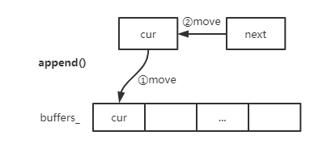
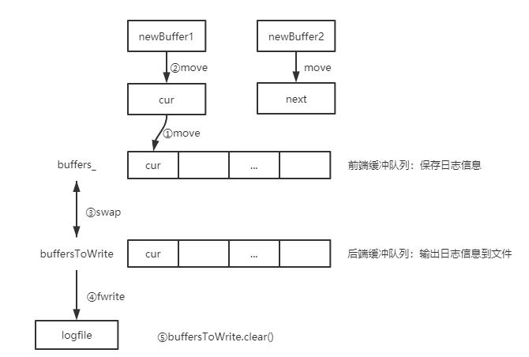

# 日志系统
# 编译运行

```shell
mkdir build
cd build
cmake ..
make
```

# 用法
在单线程下直接`LOG_XXXX << "log entry"`。
在多线程下需要先`Logger::setConcurrentMode()`创建并启动一个日志线程

> tesc.cpp

```c++
#include "Logger.h"
#include "AsyncLogger.h"
#include "Localtime.h"

#include <iostream>
#include <thread>
#include <unistd.h>
#include <stdio.h>

using namespace std;

void tf()
{
    for (int i = 0; i < 1; ++i)
    {
        LOG_TRACE << "test TRACE----------------------------";
        LOG_DEBUG << "test DEBUG----------------------------";
        LOG_INFO << "test INFO----------------------------------";
        LOG_WARN << "test WARN --------------------------------";
        LOG_ERROR << "test xxxx <<<<<<<<<<< -------";
    }
}

int main()
{
    using namespace clog;
    Logger::setLogLevel(Logger::TRACE);
    Logger::setConcurrentMode();
    Localtime begin(Localtime::now());

    thread t(tf);
    for (int i = 0; i < 1; ++i)
    {
        //Logger构造函数宏
        LOG_TRACE << "test TRACE----------------------------";
        LOG_DEBUG << "test DEBUG----------------------------";
        LOG_INFO << "test INFO----------------------------------";
        LOG_WARN << "test WARN --------------------------------";
        LOG_ERROR << "test xxxx <<<<<<<<<<< -------";
    }

    t.join();

    double times = timeDifference(Localtime::now(), begin);

    printf("Time is %10.4lf s\n", times);

    return 0;
}
```


# 模块
## LogStream

**实现功能：**日志流，实现C++风格的输出

LogStream.h实现了两个类：

- `class FixBuffer<SIZE>`：日志缓冲区，成员变量和主要成员函数如下

  - `char data_[SIZE]`：缓冲区
  - `char *cur_`：缓冲区指针
  - `void append(const char *data, size_t len)`：将数据复制到cur_中，并增加len个长度
  - `void add(size_t len)`：将cur_指针移动len个长度
  - `void reset()`：`data_`赋值给`cur_`

- `class LogStream`：**流对象**，成员变量和主要成员函数如下

  - `FixBuffer<4096> _buffer`：日志缓冲区对象
  - `LogStream &operator<<(arg)`：重载`<<`运算符，括号内传入的参数是各类型数据，**与`std::cout<<`输出到控制台不同，`LogStream`对象使用`<<`后，会把数据保存到`_buffer`中**

  - `void append(const char *data, size_t len)`：内部调用`_buffer.append(data, len)`

## Localtime

**实现功能：**输出格式化的时间

Localtime.h实现了一个类、重载比较运算符、增加时间、计算时间差：

- `class Localtime`：时间戳类，单位为微秒，成员变量和主要成员函数如下
  - `long long _microSecondsSinceEpoch`：微秒数
  - `static Localtime now()`：使用`gettimeofday()`获取当前时间，并转换为微秒数
  - `string toFormattedString(bool showMicroSeconds = true)`：，使用`localtime_r`**格式化**微秒数
- `bool operator<(Localtime lhs, Localtime rhs)`：重载<运算符，比较两个时间的大小，还实现了其他比较运算符，如`>, ==, >=, <=`
- `Localtime addTime(const Localtime localtime, double seconds)`：在原有的时间上加上秒数得到新的时间
- `double timeDifference(Localtime time1, Localtime time2)`：求两个时间到差值，返回秒数

## Logger

**实现功能：**日志对象，用户调用构造函数来输出日志

Logger.h实现了三个类、重载`LogStream`的`<<`运算符和日志类对象的宏定义：

- `class Logger`：日志类，成员变量和主要成员函数如下

  - `enum LogLevel`：定义6个日志级别（TRACE、DEBUG、INFO、WARN、ERROR、FATAL）

  - `unique_ptr<Impl> _pImpl`：`Impl`对象指针

  - `class SourceFile`：日志文件类，负责管理两个属性（文件名，文件名长度）

  - `class Impl`：日志具体操作类，成员变量和主要成员函数如下

    - ```c++
      LogLevel _level;			//日志级别
      Logger::SourceFile _file;	//日志文件对象
      int _line;					//日志所在行
      Localtime _time;			//本地时间
      LogStream _stream;    		//日志流对象
      ```

    - ```c++
      //构造函数：初始化成员函数，日志流对象输出当前线程号、格式化的时间戳、日志级别到日志文件
      //日志输出就是在这个构造函数中完成的
      Impl(LogLevel level, int savedErrno, const Logger::SourceFile &file, int line);
      ```
  
  - ```c++
    //构造函数：每个构造函数传入不同的参数，实例化一个Impl对象
    Logger(SourceFile file, int line);	//文件名、行号
    Logger(SourceFile file, int line, LogLevel level);	//文件名、行号、日志级别
    Logger(SourceFile file, int line, LogLevel level, const char *func);	//文件名、行号、日志级别、函数名
    Logger(SourceFile file, int line, bool toAbort);	//文件名、行号、错误码
    ```
  
  - `static void setConcurrentMode()`：启动异步日志线程

> Logger.cpp：异步日志的初始设置

- `AsyncLogger logger`：异步日志对象

- `pid_t tid`：当前运行的线程号

- ```c++
  //重载LogStream的<<运算符，内部调用s.append()保存数据
  LogStream &operator<<(LogStream &s, T v);	//T是一个字符串类
  LogStream &operator<<(LogStream &s, Logger::SourceFile file);
  ```

- `string g_logFileName`：日志文件名

- `LogLevel g_logLevel`：日志级别，初始化为`INFO`


## AsyncLogger

**实现功能：**双缓冲异步日志

AsyncLogger.h实现了一个类：

- `class AsyncLogger`：双缓冲异步日志类，成员变量和主要成员函数如下

  - ```c++
    std::mutex mutex_;				//缓冲区互斥锁
    std::condition_variable cond_;	//缓冲区条件变量
    
    using Buffer = detail::FixBuffer<detail::kLargeBuffer>;		//缓冲区重命名
    using BufferVector = std::vector<std::unique_ptr<Buffer>>;	//vector存放缓冲区指针
    using BufferPtr = BufferVector::value_type;		//vector中的每个元素（指向缓冲区的指针）
    
    std::thread thread_;			//日志线程
    bool running_;					//线程运行标志
    const int flushInterval_; 		//刷新缓冲区的时间间隔
    
    BufferPtr currentBuffer_; 		//vec中指向当前buffer的指针
    BufferPtr nextBuffer_;    		//vec中指向下一个buffer的指针
    BufferVector buffers_;    		//存放buffer指针的vec
    ```

  - `void start()`：创建并运行日志线程

  - `void stop()`：停止运行线程

  - `void append(const char *logline, size_t len)`：添加日志信息

  

  ```c++
  /******************************************************************** 
  Description : 
  前端在生成一条日志消息时，会调用AsyncLogging::append()。
  如果currentBuffer_够用，就把日志内容写入到currentBuffer_中，
  如果不够用(就认为其满了)，就把currentBuffer_放到已满buffer数组中，
  等待消费者线程（即后台线程）来取。则将预备好的另一块缓冲
  （nextBuffer_）移用为当前缓冲区（currentBuffer_）。
  *********************************************************************/
  void AsyncLogger::append(const char *logline, size_t len)
  {
      MutexLockGuard lock(mutex_); //保护缓冲区和缓冲队列
      // 如果当前buffer的长度大于要添加的日志记录的长度，即当前buffer还有空间，就添加到当前日志。
      if (currentBuffer_->avail() > len)
      {
          currentBuffer_->append(logline, len);
      }
      // 当前buffer已满，使用另外的缓冲区
      else
      {
          //1、先将currentBuffer_保存到缓冲区队列中
          buffers_.push_back(std::move(currentBuffer_));
          //2、如果另一块缓冲区不为空，则将预备好的另一块缓冲区移用为当前缓冲区
          if (nextBuffer_)
          {
              currentBuffer_ = std::move(nextBuffer_);
          }
          //如果前端写入速度太快了，一下子把两块缓冲都用完了，那么只好分配一块新的buffer，作当前缓冲区
          else
          {
              currentBuffer_.reset(new Buffer); // Rarely happens
          }
          //3、添加日志记录
          currentBuffer_->append(logline, len);
          //4、通知后端开始写入日志数据
          cond_.notify_one();
      }
  }
  ```

  - `void threadFunc()`：**双缓冲机制实现异步日志**

  

  ```c++
  /******************************************************************** 
  Description : 
  如果buffers_为空，使用条件变量等待条件满足（即前端线程把一个已经满了
  的buffer放到了buffers_中或者超时）。将当前缓冲区放到buffers_数组中。
  更新当前缓冲区（currentBuffer_）和另一个缓冲区（nextBuffer_）。
  将bufferToWrite和buffers_进行swap。这就完成了将写了日志记录的buffer
  从前端线程到后端线程的转变。
  *********************************************************************/
  void AsyncLogger::threadFunc()
  {
      assert(running_ == true);
      //定义两个Buffer指针
      BufferPtr newBuffer1(new Buffer);
      BufferPtr newBuffer2(new Buffer);
      // 写入日志记录文件的缓冲队列
      BufferVector buffersToWrite;
      buffersToWrite.reserve(16);
  
      //打开日志文件流
      FILE *stream = fopen(detail::getLogFileName().data(), "w");
      assert(stream);
  
      while (running_)
      {
          assert(newBuffer1 && newBuffer1->size() == 0);
          assert(newBuffer2 && newBuffer2->size() == 0);
          assert(buffersToWrite.empty());
  
          {
              //写缓冲区时，需要加锁
              std::unique_lock<std::mutex> lock(mutex_);
              // 如果buffers_为空，那么表示没有日志数据需要写入文件，那么就等待指定的时间
              if (buffers_.empty()) // unusual usage!
              {
                  cond_.wait_for(lock, std::chrono::seconds(flushInterval_));
              }
              // 无论cond是因何（一是超时，二是当前缓冲区写满了）而醒来，都要将currentBuffer_放到buffers_中。
              // 如果是因为时间到（3秒）而醒，那么currentBuffer_还没满，此时也要将之写入LogFile中。
              // 如果已经有一个前端buffer满了，那么在前端线程中就已经把一个前端buffer放到buffers_中了
              // 此时，还是需要把currentBuffer_放到buffers_中（注意，前后放置是不同的buffer，
              // 因为在前端线程中，currentBuffer_已经被换成nextBuffer_指向的buffer了）。
              buffers_.push_back(std::move(currentBuffer_));
              // 将新的buffer（newBuffer1）移用为当前缓冲区（currentBuffer_）
              currentBuffer_ = std::move(newBuffer1);
              // buffers_和buffersToWrite交换数据
              // 此时buffers_所有的数据存放在buffersToWrite，而buffers_变为空
              buffersToWrite.swap(buffers_);
              // 如果nextBuffer_为空，将新的buffer（newBuffer2）移用为另一个缓冲区（nextBuffer_）
              if (!nextBuffer_)
              {
                  nextBuffer_ = std::move(newBuffer2);
              }
          }
          assert(!buffersToWrite.empty());
          // 如果将要写入文件的buffer列表中buffer的个数大于25，那么将多余数据删除。
          // 前端陷入死循环，拼命发送日志消息，超过后端的处理能力，这是典型的生产速度超过消费速度，
          // 会造成数据在内存中的堆积，严重时引发性能问题(可用内存不足)或程序崩溃(分配内存失败)。
          if (buffersToWrite.size() > 25)
          {
              // TODO::dropping log messages
              printf("two much\n");
          }
          // 将buffersToWrite的数据写入到日志文件中
          for (size_t i = 0; i < buffersToWrite.size(); ++i)
          {
              fwrite(buffersToWrite[i]->data(), 1, buffersToWrite[i]->size(), stream);
          }
          // 重新调整buffersToWrite的大小
          if (buffersToWrite.size() > 2)
          {
              buffersToWrite.resize(2);
          }
          // 从buffersToWrite中弹出一个作为newBuffer1 
          if (!newBuffer1)
          {
              assert(!buffersToWrite.empty());
              newBuffer1 = std::move(buffersToWrite.back());
              buffersToWrite.pop_back();
              newBuffer1->reset();
          }
          // 从buffersToWrite中弹出一个作为newBuffer2
          if (!newBuffer2)
          {
              assert(!buffersToWrite.empty());
              newBuffer2 = std::move(buffersToWrite.back());
              buffersToWrite.pop_back();
              newBuffer2->reset();
          }
          // 清空buffersToWrite
          buffersToWrite.clear();
          fflush(stream);
      }
      fflush(stream);
  }
  ```

  

